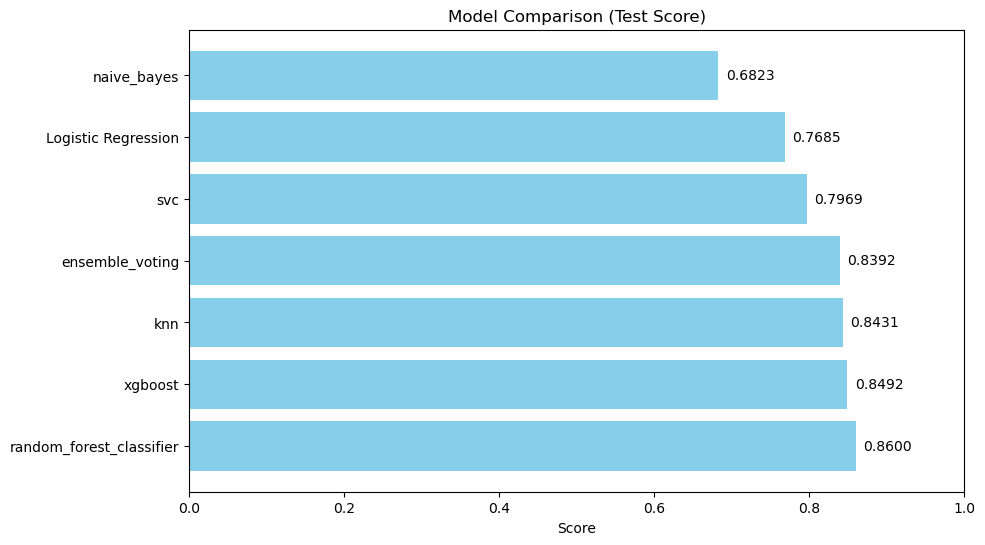
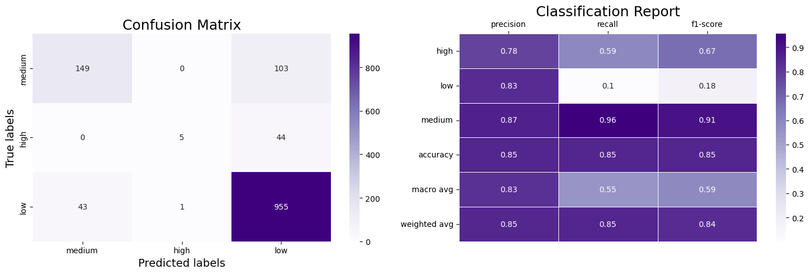

# Wine Quality Prediction

Predicts wine quality (low, medium, high) from physicochemical properties using advanced machine learning techniques. Includes robust data processing, model selection, and a user-friendly web interface.

---

## Overview

This project builds and deploys a machine learning pipeline to classify wine quality based on 12 chemical features and wine color. It covers data ingestion, preprocessing, feature engineering, model training, evaluation, and deployment.

---

## Workflow

1. **Data Ingestion & Preprocessing**
   - Supports CSV, Excel, and ZIP formats.
   - Handles missing values and outliers.
   - Scales and encodes features as needed.

2. **Feature Engineering**
   - Applies log transformation, scaling, and encoding.

3. **Modeling & Evaluation**
   - Trains and tunes multiple classifiers (Random Forest, XGBoost, SVC, KNN, Logistic Regression, Naive Bayes, Ensemble Voting).
   - Uses cross-validation and hyperparameter optimization.
   - Evaluates with accuracy, precision, recall, F1-score, and visualizations.

4. **Deployment**
   - Flask web app for real-time predictions.

---

## Model Performance

- **Best Model:** Random Forest Classifier
- **Test Accuracy:** 0.86

| Class   | Precision | Recall | F1-score |
|---------|-----------|--------|----------|
| high    | 0.78      | 0.59   | 0.67     |
| low     | 0.83      | 0.10   | 0.18     |
| medium  | 0.87      | 0.96   | 0.91     |

**Model Comparison:**


**Confusion Matrix and Classification Report:**


---

## Quickstart

1. **Clone and set up environment**
   ```bash
   git clone https://github.com/Gangadhar-katchala/wine_quality_prediction.git
   cd wine_quality_prediction
   python -m venv venv
   venv\Scripts\activate   # Windows
   # or
   source venv/bin/activate  # Mac/Linux
   pip install -r requirements.txt
   ```

2. **Run the web app**
   ```bash
   python app.py
   ```
   Visit [http://localhost:5000](http://localhost:5000) in your browser.

---

## Key Dependencies

- pandas, numpy, scikit-learn, xgboost, flask, matplotlib, seaborn

(See `requirements.txt` for full list.)

---

## Project Structure

```
wine_quality_prediction/
├── app.py                # Flask web app
├── src/                  # ML modules and pipelines
├── notebooks/            # EDA and model training
├── artifacts/            # Saved models
├── Templates/            # HTML templates
├── requirements.txt
└── README.md
```

---

## Author

Gangadhar Katchala  
[GitHub](https://github.com/Gangadhar-katchala)  
Email: katchalagangadhar@gmail.com

---

**License:** For educational purposes.

## 📞 Contact

Gangadhar Katchala - [@Gangadhar-katchala](https://twitter.com/Gangadhar-katchala) - katchalagangadhar@gmail.com

Project Link: [https://github.com/Gangadhar-katchala/wine_quality_prediction](https://github.com/Gangadhar-katchala/wine_quality_prediction)
